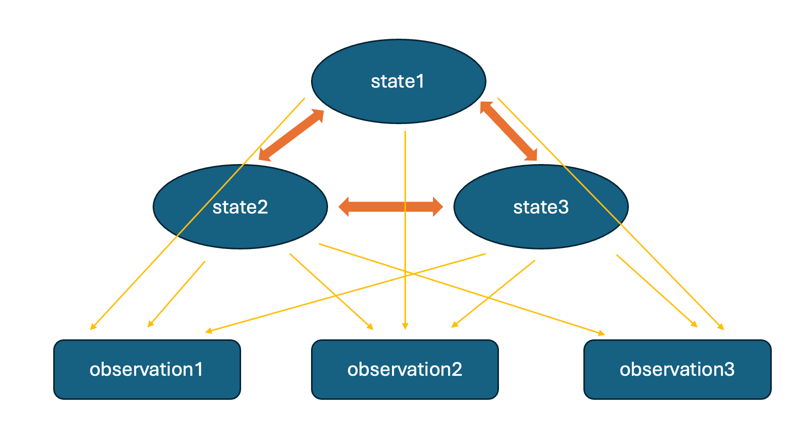

# HMM_predictor

- Use Viterbi method or Comparison method to predict, seeing `hmm_model.py`.

- Make some trading decision via the prediction, seeing `trading_strategy.py`.

- `plotting.py` gives some plotting functions, like plotting the change of asset and the point of buy and sell.

### Key Concepts:

- **States**: The system can be in one of several possible states, but the true state is not directly visible (hidden). These states evolve over time according to a Markov process.
  
- **Observations**: While the actual states are hidden, we observe some data that is probabilistically dependent on these hidden states. These are the observable outputs.

- **Transition Probability**: This defines the probability of moving from one hidden state to another.

- **Emission Probability**: This defines the probability of observing a particular output given the current hidden state.

- **Initial State Probability**: The probability distribution over which state the model starts in.

